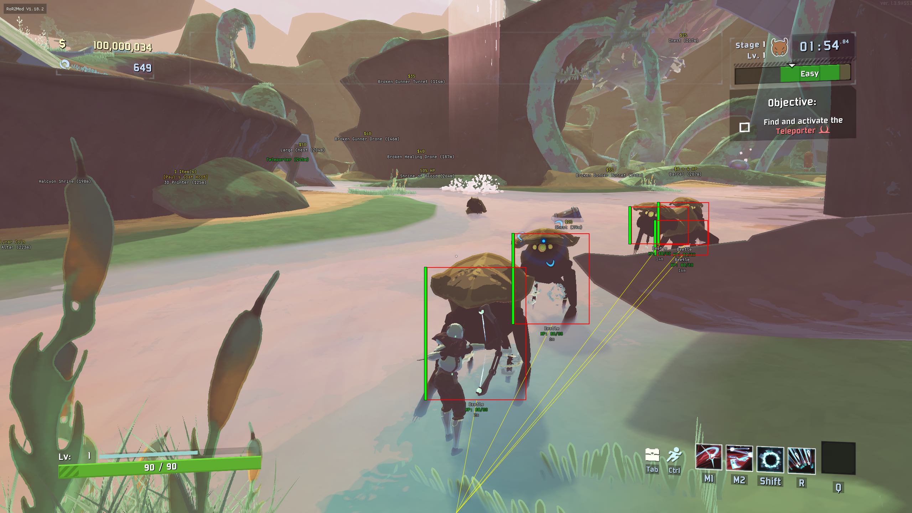
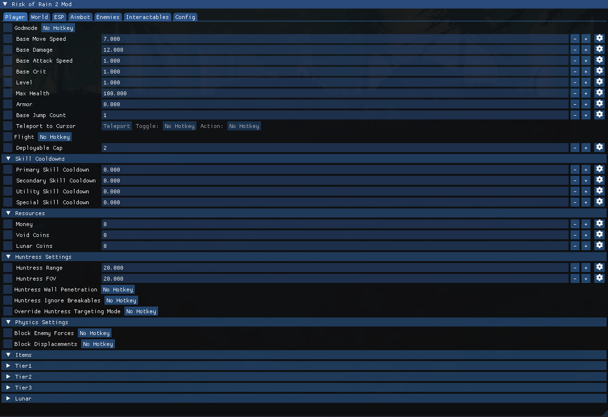
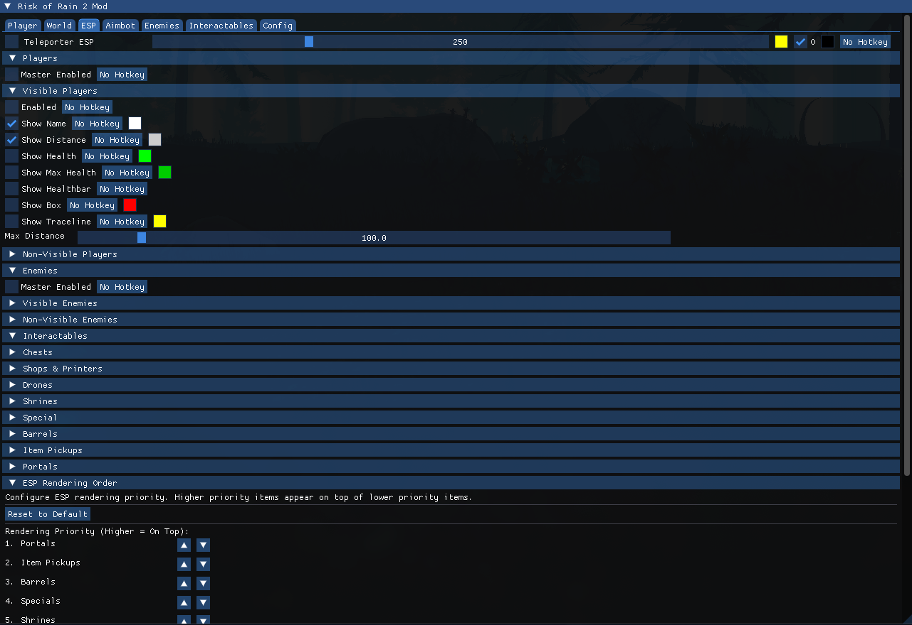
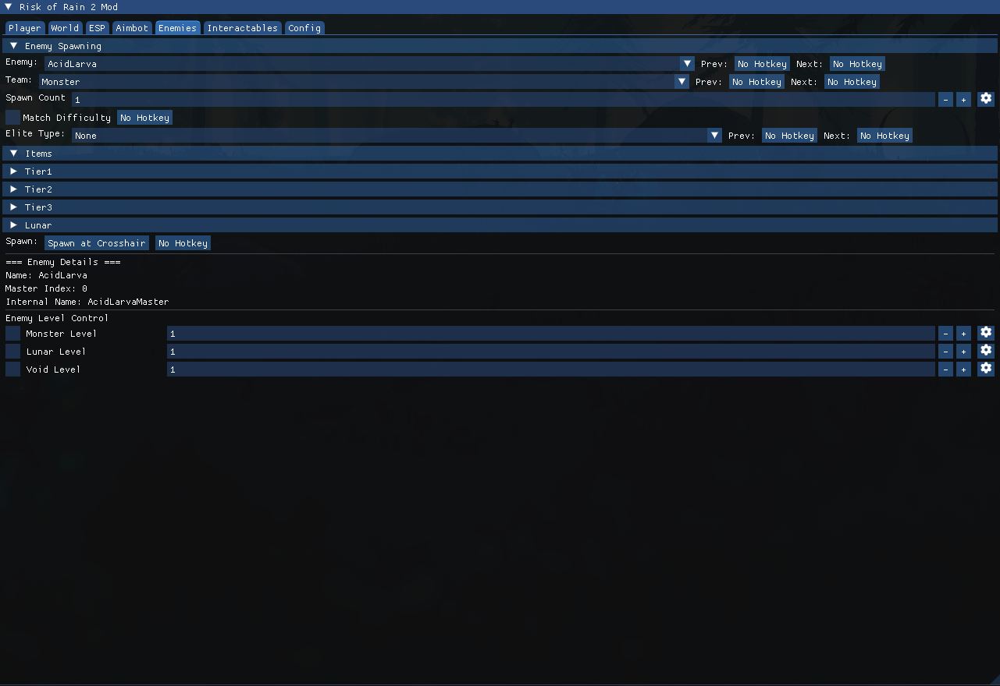
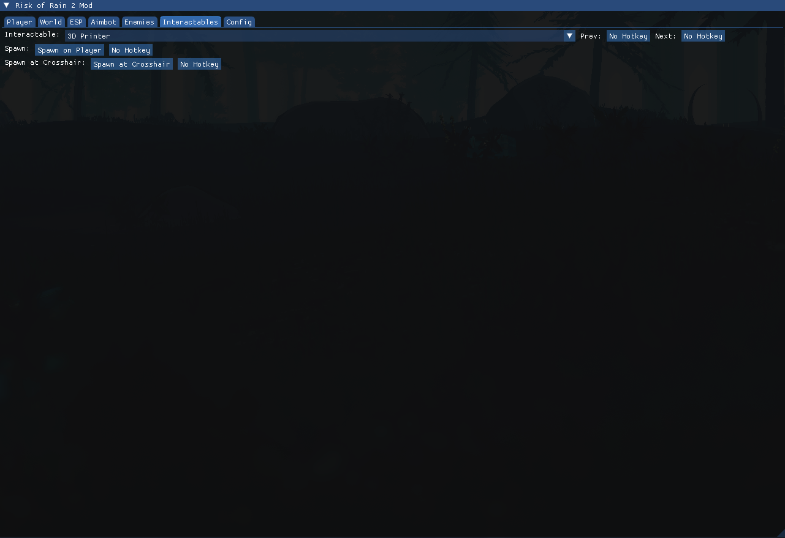
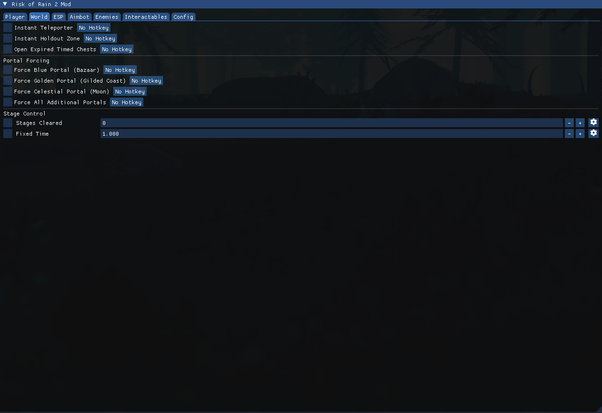

# Risk of Rain 2 Mod

## Features
<details>
<summary>Click to view features</summary>

### Player Modifications
**Character Stats**
- Godmode
- Base move speed, damage, attack speed, crit, jump count
- Max health and armor
- Player level
- Skill cooldown overrides (Primary, Secondary, Utility, Special)

**Character Abilities**
- Teleport to cursor position
- Flight
- Deployable capacity override
- Block enemy forces and displacement effects

**Resources**
- Money
- Lunar coins
- Void coins

**Item Management**
- Complete item spawning system with all items
- Item protection (prevent removal/stealing)

**Huntress Enhancements**
- Tracking range and FOV modification
- Wall penetration for targeting
- Ignore breakables
- Targeting mode override (None, Distance, Angle, Distance + Angle)

### ESP
**Entity ESP**
- **Players/Enemies** Health bars, distance indicators, customizable colors, visibility tracking, tracelines
- **Teleporters** Multi-teleporter support

**Interactable ESP (Organized by Category)**
- Chests
- Shops & Printers
- Drones
- Shrines
- Barrels
- Item Pickups
- Portals
- Special (Newt Altars, Assessment Focus, Beacons, etc)

**ESP Features**
- Distance filtering for all categories
- Customizable colors and outlines
- Visibility indicators
- Hierarchical rendering system with configurable priority
- Real-time position updates for moving objects

### World Modifications
**Teleporter Control**
- Instant teleporter completion
- Instant holdout zone completion

**Portal Control**
- Force Blue Portal (Bazaar)
- Force Golden Portal (Gilded Coast)
- Force Celestial Portal (Moon)
- Force All Additional Portals

**World State**
- Stages cleared counter override
- Fixed time override
- Open expired timed chests

### Enemy Control
**Enemy Level Control**
- Monster team level override
- Lunar team level override
- Void team level override

**Enemy Spawning**
- Spawn any enemy type at crosshair
- Team selection (Player, Neutral, Monster, Lunar, Void)
- Spawn count control (1-100)
- Elite type selection with all variants
- Difficulty matching
- Item selection for spawned enemies

### Interactable Spawning
**Complete Spawning System**
- Spawn at player position or crosshair location
- All chests, drones, shrines, portals, and special objects

### Configuration & Customization
**Font System**
- Custom font loading support
- Font size controls for ESP elements
- Unicode character support

**Configuration Management**
- Multiple configuration profiles

</details>

## Screenshots
<details>
<summary>Click to view screenshots</summary>














</details>

## Building

### Method 1: Using the terminal
```bash
mkdir -p build
cd build
cmake -DCMAKE_TOOLCHAIN_FILE=../mingw-toolchain.cmake ..
cmake --build .
```

### Method 2: Using VSCode Tasks
1. In VSCode, press Ctrl+Shift+B to build

or

1. In VSCode, press Ctrl+Shift+P, select "Tasks: Run Task", and select "Build All"

## Running

### VSCode Tasks (Linux only)
1. In VSCode, press Ctrl+Shift+P, select "Tasks: Run Task", and select "Inject and Run"
   - Note: Tasks currently use protontricks-launch and need modification for native Windows use

### Windows
```cmd
# Method 1: Double-click injector.exe in the build directory
# (uses defaults: Risk of Rain 2.exe and RoR2Mod.dll)

# Method 2: Command line (run as administrator if needed):
injector.exe

# Method 3: Specify custom process/DLL:
injector.exe "Risk of Rain 2.exe" "RoR2Mod.dll"
```

### Linux
```bash
# From the build directory:
protontricks-launch --no-bwrap --appid 632360 ./injector.exe "Risk of Rain 2.exe" "Z:/path/to/RoR2Mod.dll"
```

## Debugging

1. Inject the mod using one of the options above
2. In VSCode run the `Attach to Risk of Rain 2` launch target
3. Select the "Risk of Rain 2.exe" process
4. Pause execution and switch to the debug console
5. Run: `-exec load-dll` to load the debug symbols into GDB
6. You can now set breakpoints and step through the code in VSCode
